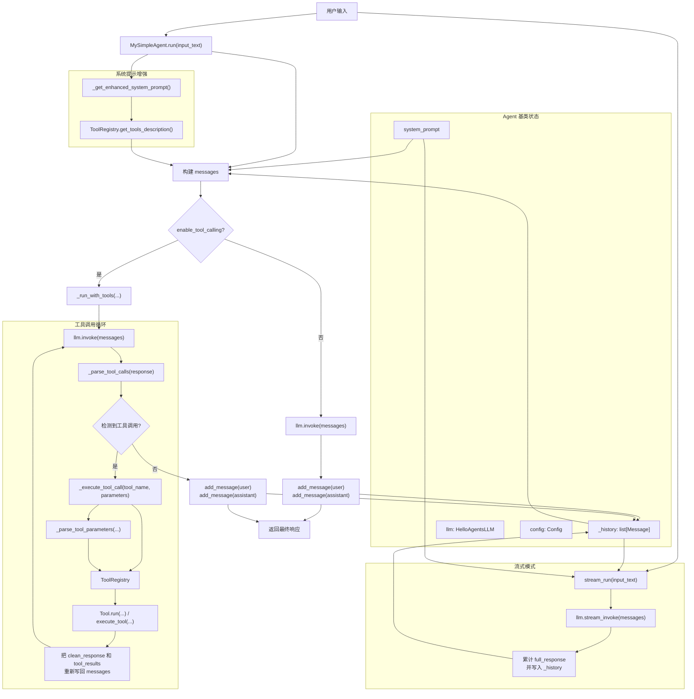
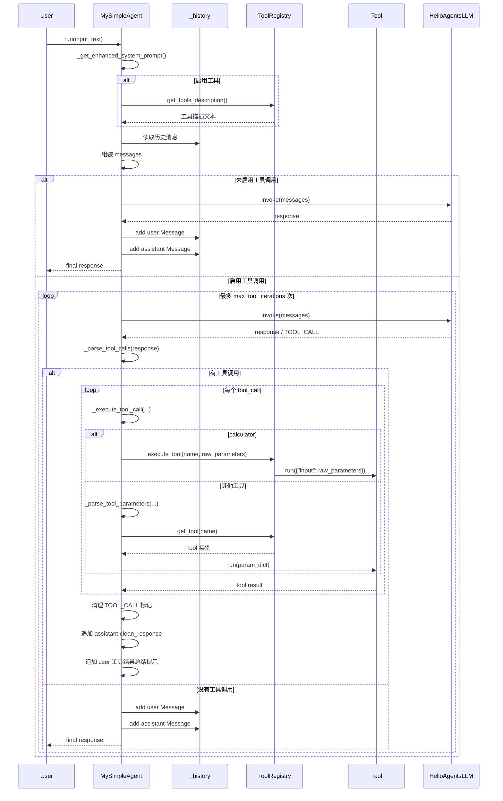

# MySimpleAgent 架构图

本文描述 [hello_agents/agents/simple_agent.py](/Users/bytedance/learning/agent-learning/hello_agents/agents/simple_agent.py:7) 中 `MySimpleAgent` 的模块组成与信息流转。

## 1. 模块关系图

## 2. 信息流转时序图

## 3. 模块职责

- `MySimpleAgent`
  负责对话主流程、工具调用循环、消息拼装、流式输出。
- `SimpleAgent`
  是框架内的简单对话 Agent 基类；`MySimpleAgent` 继承自它并重写了 `run` / `stream_run`。
- `Agent`
  提供通用状态与能力，包括 `name`、`llm`、`system_prompt`、`config`、`_history`、`add_message()`、`get_history()`。
- `Message`
  历史消息的数据模型，保存 `content`、`role`、`timestamp`、`metadata`。
- `HelloAgentsLLM`
  对接底层模型服务，提供 `invoke()` 与 `stream_invoke()`。
- `ToolRegistry`
  管理工具注册、查找、执行，以及生成工具描述。
- `Tool`
  具体工具的抽象基类，实际工具通过 `run(parameters)` 返回字符串结果。

## 4. 关键数据对象

- `messages`
  发送给 LLM 的上下文列表，元素格式为 `{"role": "...", "content": "..."}`。
- `_history`
  Agent 内部保存的历史消息列表，元素类型为 `Message`。
- `tool_calls`
  从 LLM 响应中解析出的工具调用列表，格式为 `tool_name + parameters + original`。
- `tool_results_text`
  多个工具结果拼接后的文本，会作为新的用户消息回灌给 LLM。

## 5. 一次完整调用的最小闭环

1. 用户输入 `input_text`。
2. Agent 读取 `system_prompt`、`_history`，构造 `messages`。
3. LLM 基于 `messages` 生成响应。
4. 如果响应包含 `[TOOL_CALL:...]`，则执行工具并把结果回灌给 LLM。
5. 得到最终响应后，将本轮 `user` 与 `assistant` 消息写入 `_history`。
6. 返回最终文本给调用方。

## 6. 代码映射

- 主入口: [hello_agents/agents/simple_agent.py](/Users/bytedance/learning/agent-learning/hello_agents/agents/simple_agent.py:32)
- 工具循环: [hello_agents/agents/simple_agent.py](/Users/bytedance/learning/agent-learning/hello_agents/agents/simple_agent.py:85)
- 工具解析: [hello_agents/agents/simple_agent.py](/Users/bytedance/learning/agent-learning/hello_agents/agents/simple_agent.py:136)
- 工具执行: [hello_agents/agents/simple_agent.py](/Users/bytedance/learning/agent-learning/hello_agents/agents/simple_agent.py:152)
- 参数解析: [hello_agents/agents/simple_agent.py](/Users/bytedance/learning/agent-learning/hello_agents/agents/simple_agent.py:173)
- 流式入口: [hello_agents/agents/simple_agent.py](/Users/bytedance/learning/agent-learning/hello_agents/agents/simple_agent.py:201)
- 历史消息定义: [hello_agents/core/agent.py](/Users/bytedance/learning/agent-learning/hello_agents/core/agent.py:22)

## 7. 一个容易混淆的点

当前仓库里的 `hello_agents/core/*.py` 与 `hello_agents/agents/simple_agent.py` 是学习/改写版本；而你代码里 `from hello_agents import SimpleAgent` 实际引用的 `SimpleAgent` 框架实现来自 `.venv/lib/python3.12/site-packages/hello_agents/...`。所以理解架构时要把“你写的 `MySimpleAgent`”和“框架提供的 `SimpleAgent/Agent`”分开看。
